<p align="center"></p>
<h1 align="center">Ilium</h1>
<p align="center"><strong>AI names agents and organizes your project tree.</strong><br>Keep agent work, terminals, editors, and boards together, with activity in view.</p>
<p align="center"><sub>Linux · macOS · Windows · Rust · MIT</sub></p>
<p align="center"><a href="#quick-start">Quick start</a> · <a href="#daily-use">Daily use</a> · <a href="#see-it-in-action">Demos</a> · <a href="#worktrees-and-session-recovery">Worktrees</a> · <a href="#full-reference">Reference</a></p>

## Quick start

Linux and macOS:

```sh
curl --proto '=https' --tlsv1.2 -LsSf https://ilium-setup.pages.dev/install.sh | sh
```

Windows PowerShell:

```powershell
irm https://ilium-setup.pages.dev/install.ps1 | iex
```

Open a new terminal in your project and run `ilium`. Re-run the install command
to upgrade. The installer downloads a matching client/server pair; no Rust
toolchain is needed. [Install from release packages](#install-from-release-packages) · [Build from source](#building-from-source).

Use a UTF-8 terminal with 256-colour support. Install your agent CLI separately.

> **Network by default:** fresh installs send automatic title and tree-organization requests to Kilo Gateway. Disable those triggers or choose a local provider before entering sensitive content. [See the inference settings](#inference-and-privacy).

## See it in action

<table width="100%">
<tbody>
<tr>
<td width="50%" valign="top">
<p>
<strong>AI names agents and organizes the project tree</strong>
</p>
<p>
<a href="assets/demos/01-ai-tree.gif?raw=true" target="_blank" rel="noopener noreferrer">

</a>
</p>
</td>
<td width="50%" valign="top">
<p>
<strong>Control Ilium and prompt agents with voice</strong>
</p>
<p>
<a href="assets/demos/02-voice-control.gif?raw=true" target="_blank" rel="noopener noreferrer">
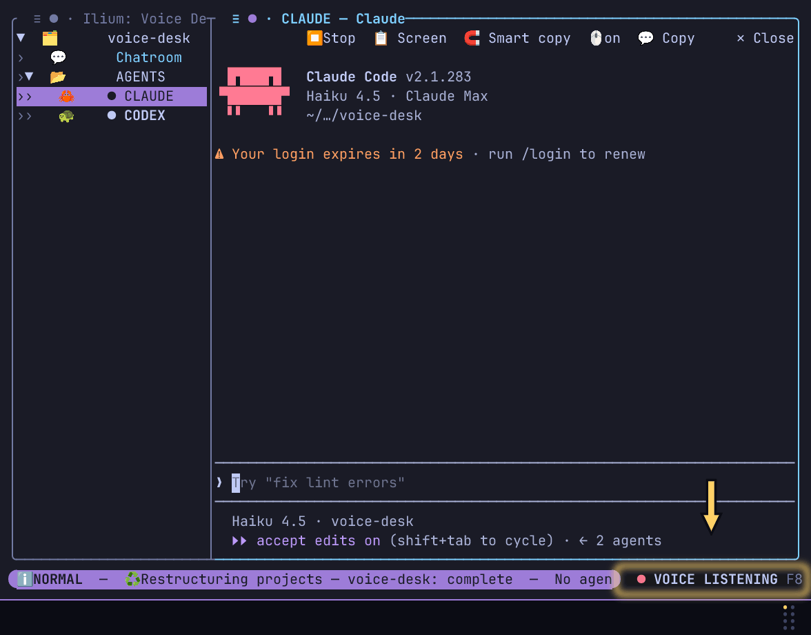
</a>
</p>
</td>
</tr>
<tr>
<td width="50%" valign="top">
<p>
<strong>Give agent panes automatic titles</strong>
</p>
<p>
<a href="assets/demos/03-contextual-titles.gif?raw=true" target="_blank" rel="noopener noreferrer">

</a>
</p>
</td>
<td width="50%" valign="top">
<p>
<strong>Transfer a terminal screen between panes</strong>
</p>
<p>
<a href="assets/demos/05-screen-transfer.gif?raw=true" target="_blank" rel="noopener noreferrer">
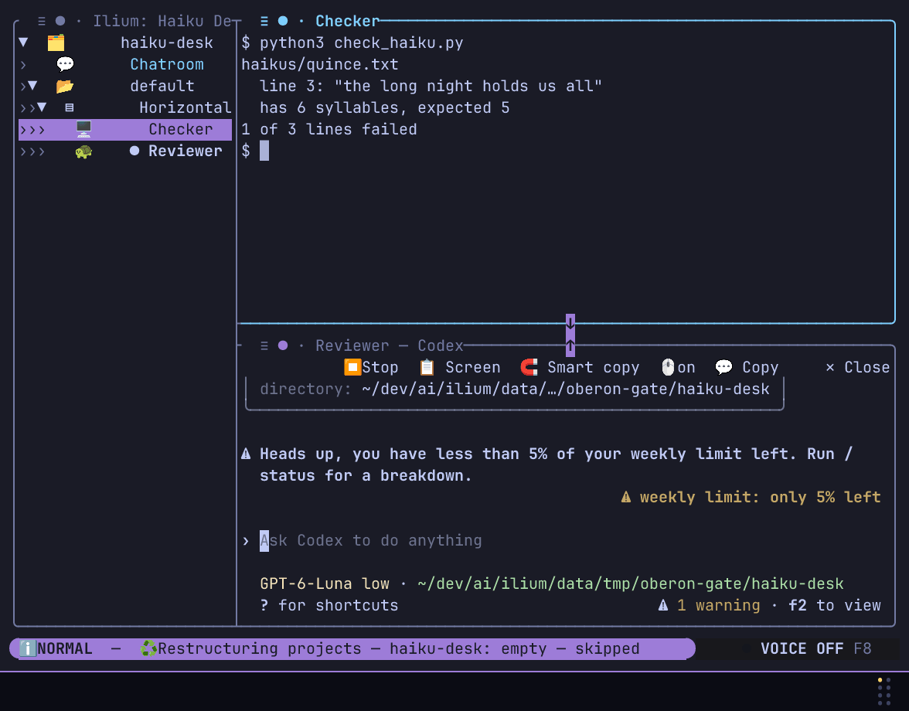
</a>
</p>
</td>
</tr>
<tr>
<td width="50%" valign="top">
<p>
<strong>Inspect agent usage and recorded costs</strong>
</p>
<p>
<a href="assets/demos/06-cost-and-stats.gif?raw=true" target="_blank" rel="noopener noreferrer">
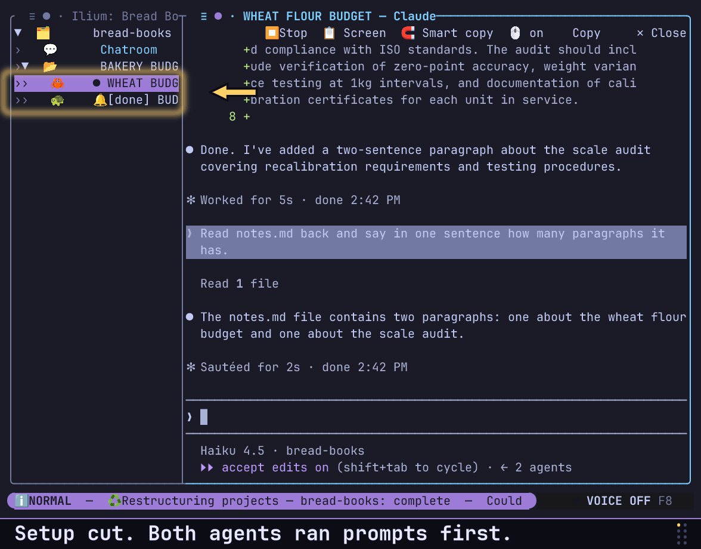
</a>
</p>
</td>
<td width="50%" valign="top">
<p>
<strong>Track agent status and current goals</strong>
</p>
<p>
<a href="assets/demos/08-agent-activity.gif?raw=true" target="_blank" rel="noopener noreferrer">
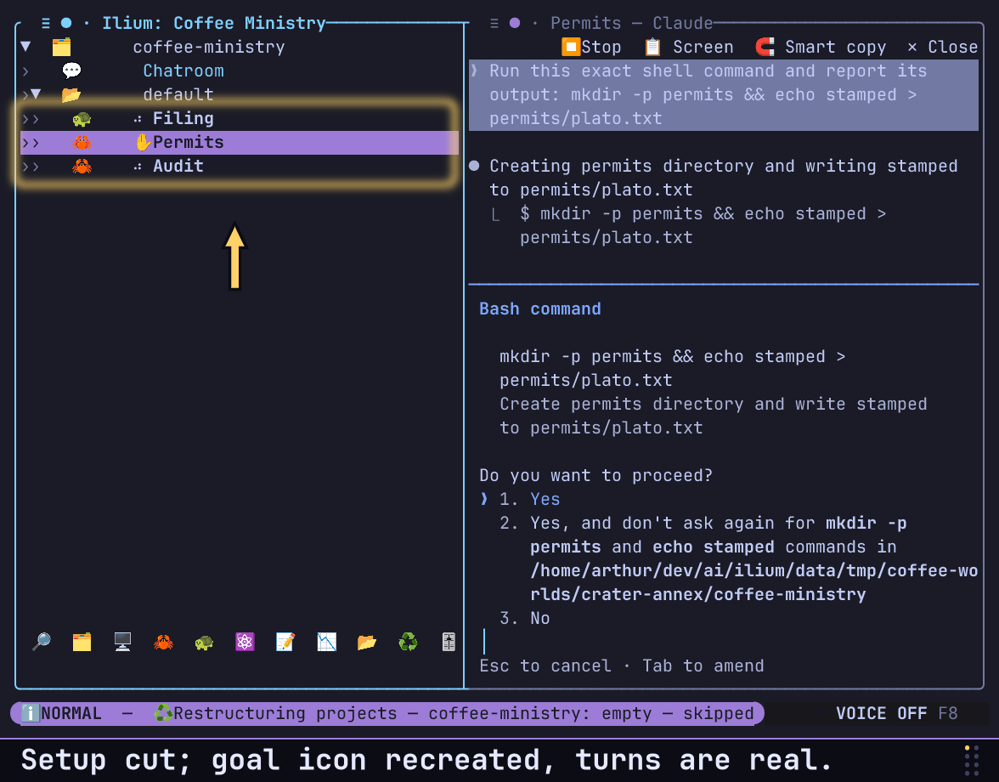
</a>
</p>
</td>
</tr>
<tr>
<td width="50%" valign="top">
<p>
<strong>Use agents, editors, and terminals side by side</strong>
</p>
<p>
<a href="assets/demos/10-mixed-splits.gif?raw=true" target="_blank" rel="noopener noreferrer">

</a>
</p>
</td>
<td width="50%" valign="top">
<p>
<strong>Select and copy terminal output</strong>
</p>
<p>
<a href="assets/demos/11-smart-copy.gif?raw=true" target="_blank" rel="noopener noreferrer">

</a>
</p>
</td>
</tr>
<tr>
<td width="50%" valign="top">
<p>
<strong>Queue prompts for an agent</strong>
</p>
<p>
<a href="assets/demos/13-prompt-queue.gif?raw=true" target="_blank" rel="noopener noreferrer">

</a>
</p>
</td>
<td width="50%" valign="top">
<p>
<strong>Get results from background tasks</strong>
</p>
<p>
<a href="assets/demos/14-progress-monitor.gif?raw=true" target="_blank" rel="noopener noreferrer">

</a>
</p>
</td>
</tr>
<tr>
<td width="50%" valign="top">
<p>
<strong>Search agents, files, and terminals</strong>
</p>
<p>
<a href="assets/demos/17-workspace-search.gif?raw=true" target="_blank" rel="noopener noreferrer">
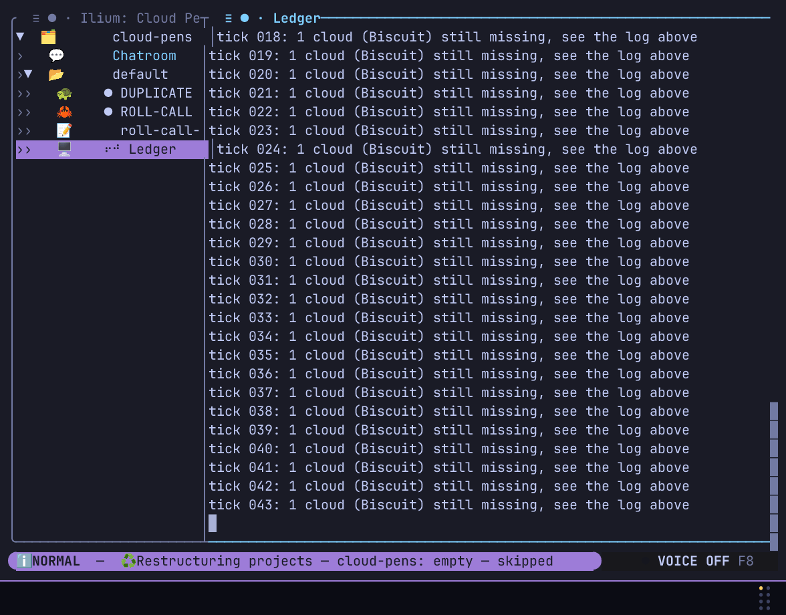
</a>
</p>
</td>
<td width="50%" valign="top">
<p>
<strong>See live agent goals in the project tree</strong>
</p>
<p>
<a href="assets/demos/22-goal-indicators.gif?raw=true" target="_blank" rel="noopener noreferrer">

</a>
</p>
</td>
</tr>
<tr>
<td width="50%" valign="top">
<p>
<strong>Resume agent sessions after a reboot</strong>
</p>
<p>
<a href="assets/demos/24-agents-survive-reboots.gif?raw=true" target="_blank" rel="noopener noreferrer">
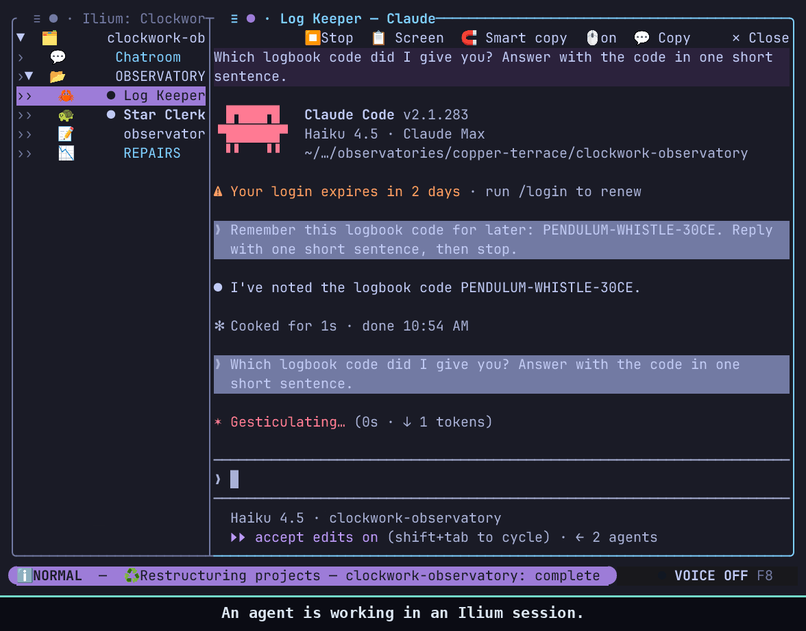
</a>
</p>
</td>
<td width="50%" valign="top"></td>
</tr>
</tbody>
</table>

<details>
<summary>Show the other 14 demos</summary>

<table width="100%">
<tbody>
<tr>
<td width="50%" valign="top">
<p>
<strong>Schedule input for a pane</strong>
</p>
<p>
<a href="assets/demos/04-scheduled-input.gif?raw=true" target="_blank" rel="noopener noreferrer">
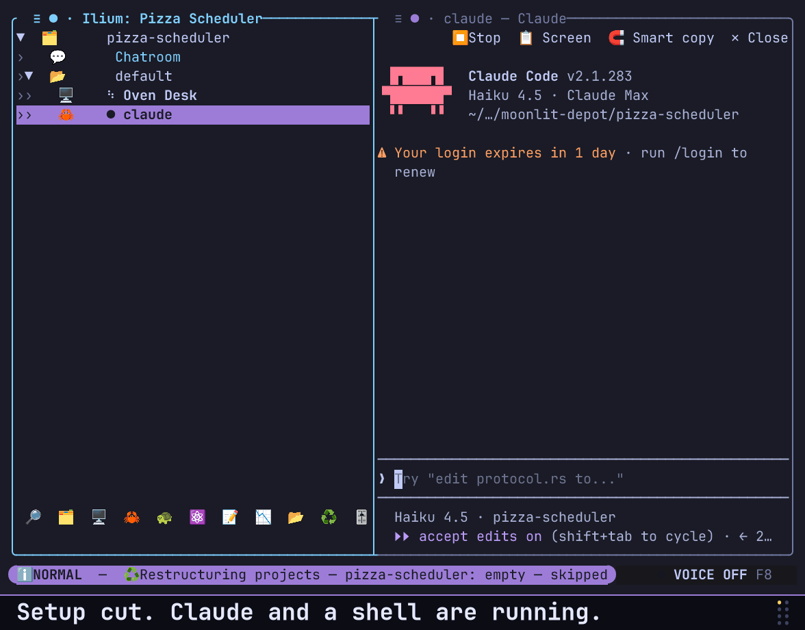
</a>
</p>
</td>
<td width="50%" valign="top">
<p>
<strong>Set interface and board preferences</strong>
</p>
<p>
<a href="assets/demos/07a-settings-tour-a.gif?raw=true" target="_blank" rel="noopener noreferrer">
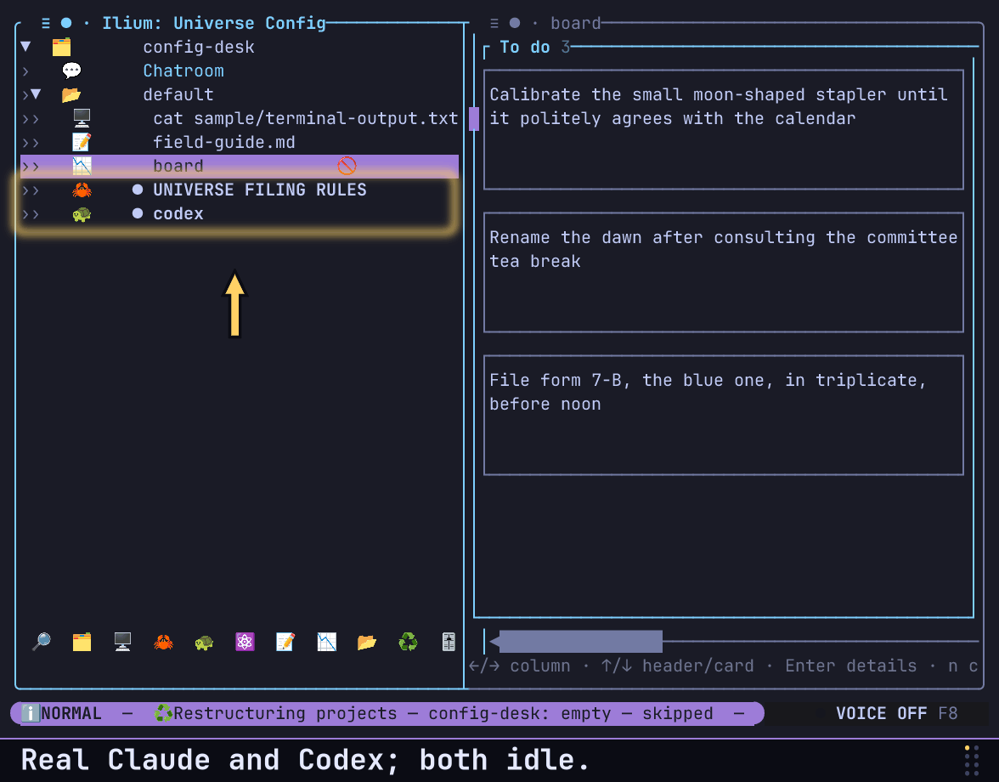
</a>
</p>
</td>
</tr>
<tr>
<td width="50%" valign="top">
<p>
<strong>Configure voice and AI providers</strong>
</p>
<p>
<a href="assets/demos/07b-settings-tour-b.gif?raw=true" target="_blank" rel="noopener noreferrer">

</a>
</p>
</td>
<td width="50%" valign="top">
<p>
<strong>Configure automatic titles</strong>
</p>
<p>
<a href="assets/demos/07c-settings-tour-c.gif?raw=true" target="_blank" rel="noopener noreferrer">

</a>
</p>
</td>
</tr>
<tr>
<td width="50%" valign="top">
<p>
<strong>Rearrange panes without stopping their processes</strong>
</p>
<p>
<a href="assets/demos/09-pane-tree.gif?raw=true" target="_blank" rel="noopener noreferrer">

</a>
</p>
</td>
<td width="50%" valign="top">
<p>
<strong>Request updates from active agents</strong>
</p>
<p>
<a href="assets/demos/12-ask-for-update.gif?raw=true" target="_blank" rel="noopener noreferrer">
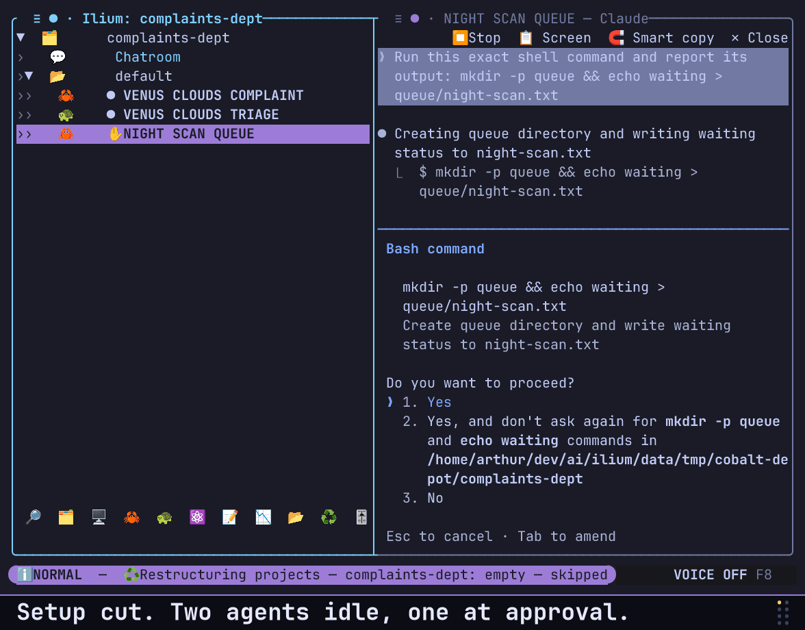
</a>
</p>
</td>
</tr>
<tr>
<td width="50%" valign="top">
<p>
<strong>Track work on a Kanban board</strong>
</p>
<p>
<a href="assets/demos/15-kanban.gif?raw=true" target="_blank" rel="noopener noreferrer">
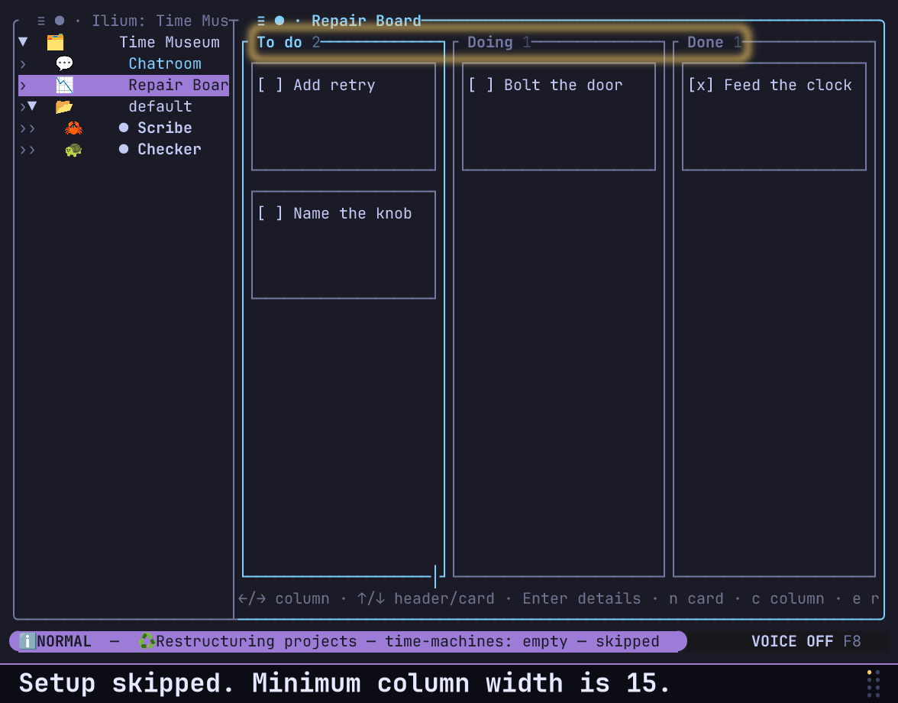
</a>
</p>
</td>
<td width="50%" valign="top">
<p>
<strong>Start a Codex agent from a TODO</strong>
</p>
<p>
<a href="assets/demos/16-agent-from-line.gif?raw=true" target="_blank" rel="noopener noreferrer">
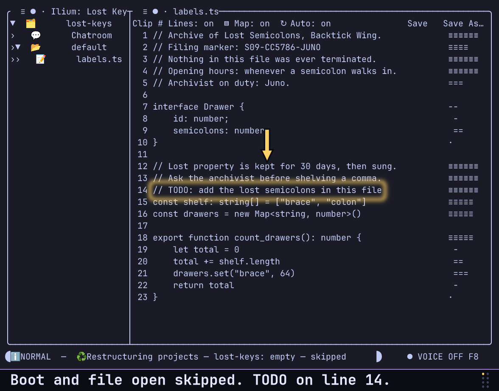
</a>
</p>
</td>
</tr>
<tr>
<td width="50%" valign="top">
<p>
<strong>Detach and reconnect while agents keep running</strong>
</p>
<p>
<a href="assets/demos/18-detach-reattach.gif?raw=true" target="_blank" rel="noopener noreferrer">
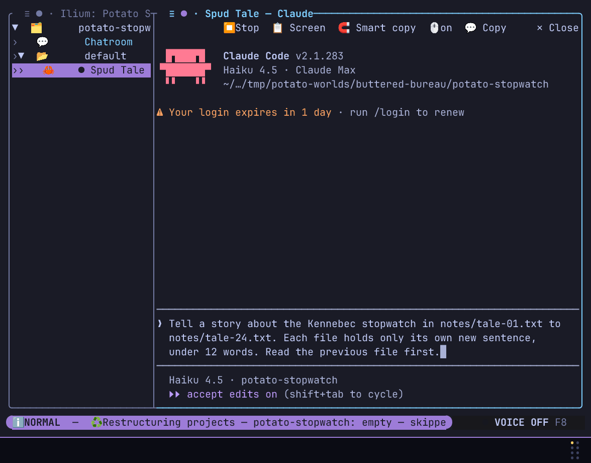
</a>
</p>
</td>
<td width="50%" valign="top">
<p>
<strong>Edit Markdown in a pane</strong>
</p>
<p>
<a href="assets/demos/19-markdown-editor.gif?raw=true" target="_blank" rel="noopener noreferrer">
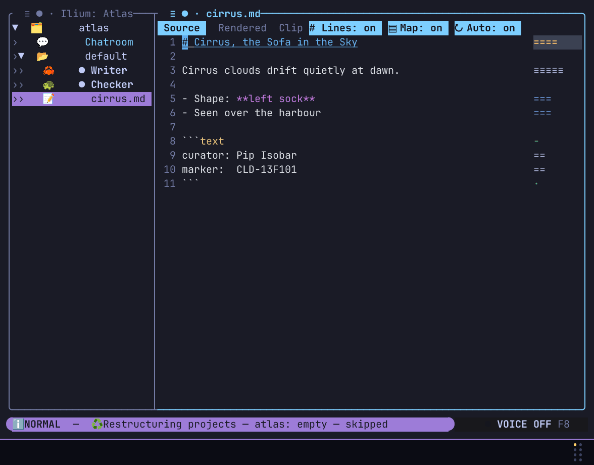
</a>
</p>
</td>
</tr>
<tr>
<td width="50%" valign="top">
<p>
<strong>Coordinate Claude and Codex with Chatroom</strong>
</p>
<p>
<a href="assets/demos/20-chatroom.gif?raw=true" target="_blank" rel="noopener noreferrer">
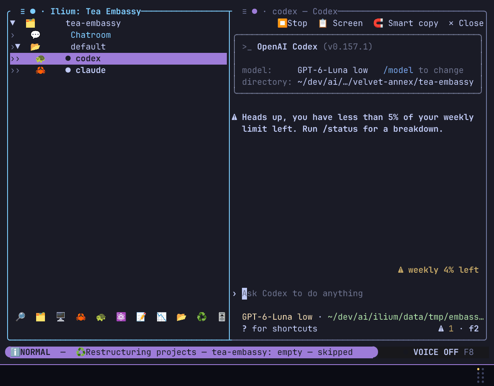
</a>
</p>
</td>
<td width="50%" valign="top">
<p>
<strong>Respond to confirmation prompts automatically</strong>
</p>
<p>
<a href="assets/demos/21-text-triggers.gif?raw=true" target="_blank" rel="noopener noreferrer">

</a>
</p>
</td>
</tr>
<tr>
<td width="50%" valign="top">
<p>
<strong>Restore panes and resume agent sessions</strong>
</p>
<p>
<a href="assets/demos/23-snapshot-resume.gif?raw=true" target="_blank" rel="noopener noreferrer">
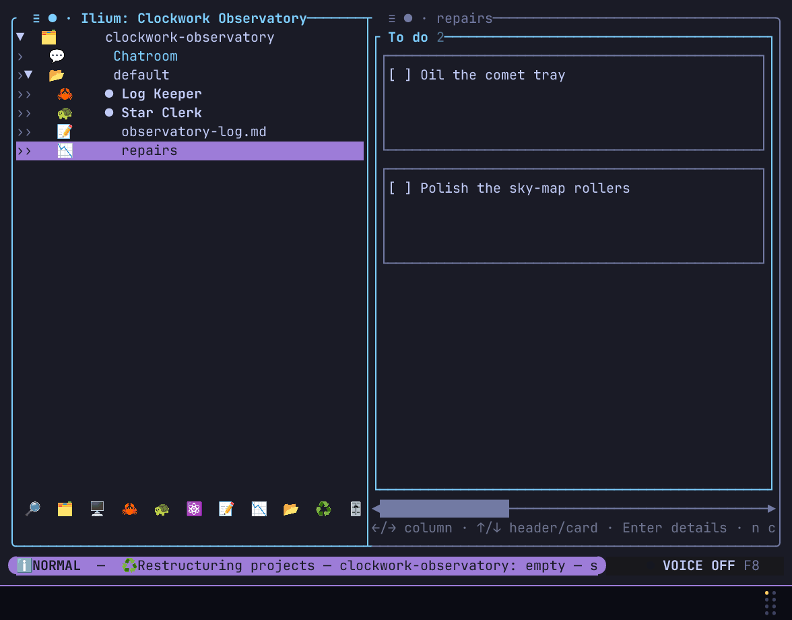
</a>
</p>
</td>
<td width="50%" valign="top">
<p>
<strong>Run agents in their own worktrees</strong>
</p>
<p>
<a href="assets/demos/25-worktree-agent.gif?raw=true" target="_blank" rel="noopener noreferrer">
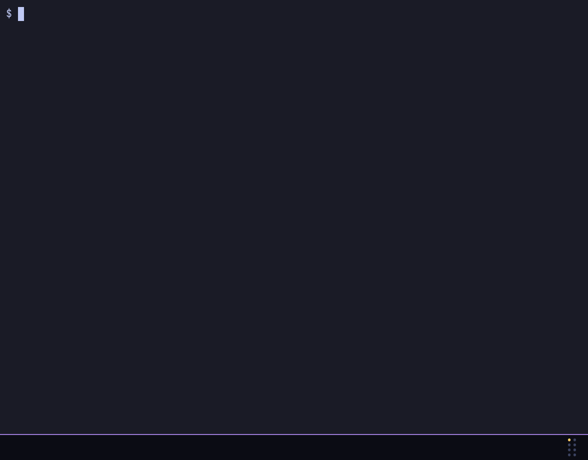
</a>
</p>
</td>
</tr>
</tbody>
</table>

</details>

## Daily use

Prefix: `Ctrl+B`.

| After prefix | Action |
| --- | --- |
| `c` / `e` / `B` | New terminal / editor / board |
| `W` | New agent in a Git worktree |
| `g` / `"` | New group / split view |
| `m` / `,` | Move / rename the selected entry |
| `f` | Search agents, terminals, and files |
| `[` / `]` | Scroll pane history |
| `:` / `?` | Settings / key reference |
| `d` / `&` | Detach / kill the session |

Reattach: run `ilium` in the project directory. In tmux, double the prefix to pass it through. Remap it in Settings.

## What Ilium does

<table width="100%">
<tbody>
<tr>
<td width="50%" valign="top"><strong>Arrange</strong><br>Group panes and split the screen four ways. The project tree stays visible.</td>
<td width="50%" valign="top"><strong>Track</strong><br>Identify agent CLIs from process trees and read activity from terminal screens.</td>
</tr>
<tr>
<td width="50%" valign="top"><strong>Separate</strong><br>Start agents in linked Git worktrees. Unclear file, process, or ownership state blocks cleanup.</td>
<td width="50%" valign="top"><strong>Resume</strong><br>Detach without stopping panes. Recovery rebuilds the layout and relaunches pane programs.</td>
</tr>
</tbody>
</table>

Also included: workspace search, Smart Copy, scheduled input, prompt queues, Chatroom, and transcript-backed Costs &amp; stats for Claude Code and Codex. The stats popover shows what the agent CLI reported; the snapshot can lag live use. The tree can also show estimated spend (see Agent cost below).

### Agent monitoring

Normal mode separates agent identity, longer-running work, and current activity. Attention mode shows the highest-priority status. Hover for the reason. When nothing needs attention, a working agent can still show a running indicator (working icon, spinner, pulsing dot, steady dot, title accent, or off), chosen in Settings > Agent Monitoring. A live progress monitor can suppress the finished-turn alert while the agent is idle. A `/goal` badge reports observed state; Ilium does not control the agent.

### Agent cost

Settings > Agent Cost puts a spend indicator on each agent row. Figures are estimates from the agent's transcript and its sub-agent transcripts at API list prices (Claude Code's own recorded total wins when larger, which matters for advisor-model calls that no transcript records); a leading `~` means a model had no known price, and subscription plans are not billed this amount. By default a five-cell meter `▰▰▰▱▱` appears while you hover an agent, just left of the row's buttons.

Pick how "a lot" is decided: fixed dollar bands, relative to the agents open now, relative to your own past sessions (the default), a per-agent budget, or current burn rate. Then switch on any of: a level glyph, glyph and dollars, the meter, a burn sparkline (six hours by default, any window), group and project totals, a detail card beside the tree, a total in the tree title, and a spike marker. Each one is visible always or only while hovering that entry. The tab can also sort the tree by cost. Unknown models can be priced under `[cost.prices]` in `config.toml`.

## Worktrees and session recovery

Start an agent from the tree, a project menu, `Ctrl+B W`, or the CLI:

```sh
ilium new-pane --worktree --branch agent/fix-login -- codex
```

Use an unused branch; `--base <ref>` overrides the repository default. Creation runs Git hooks and filters and reports JSONL progress. Settings → Git has a Linux post-create command for submodules and LFS.

Ilium removes only worktrees it created. It keeps branches by default; discarding files requires the full path, and branch deletion is separate. Cleanup is offered only for clean, merged worktrees with no other pane or unresolved ownership claim. Unclear file or process state blocks removal. If creation fails after Git leaves a checkout behind, Ilium reports its path.

Snapshots live at `<project>/.ilium/sessions/<name>.json`; rolling snapshot backups live under `.ilium/backups/`. Add `.ilium/` to `.gitignore` if session data should stay out of the repository. Backups do not include files edited inside pane applications.

After a server restart or reboot, Ilium rebuilds the tree and relaunches pane programs. It can request a verified Claude Code, Codex, or Antigravity session when that provider's data still exists; the original processes and unsaved in-process state do not survive. `--restart-server` keeps the snapshot, `--reset-session` deletes it, and `ilium kill-session <name>` ends the session and its panes.

## Full reference

### Install and platform support

Ilium is version `0.1.0`. Linux is the primary platform; macOS and Windows have platform-specific transport, process, and PTY implementations. The current CI workflow builds and tests the full workspace, with different coverage and results by OS:

| Platform | Implementation and limits | Automated checks | Latest public CI for `ed82eb0` |
| --- | --- | --- | --- |
| Linux | Primary platform. Worktree post-create setup is available. | Workspace build and tests, plus formatting and Clippy. | [Run #102](https://github.com/arthurwolf/ilium/actions/runs/36311258075/job/108597492305): formatting and Clippy passed; workspace tests failed. |
| macOS | Platform support is implemented; worktree post-create setup is Linux-only. | Workspace build and tests on pushes to `master` and manual runs; skipped on pull requests. | [Run #102](https://github.com/arthurwolf/ilium/actions/runs/36311258075/job/108597491928): build passed; workspace tests failed. |
| Windows | Platform support is implemented; worktree post-create setup is Linux-only. Most PTY integration tests are Unix-only; one ConPTY smoke test runs on Windows. | Workspace build and tests. | [Run #102](https://github.com/arthurwolf/ilium/actions/runs/36311258075/job/108597492028): build failed, so tests did not run. |

Run #102 is the latest public CI result checked on 2026-09-27. Check [CI](https://github.com/arthurwolf/ilium/actions) for newer results.

### Install from release packages

Download prebuilt packages from [GitHub Releases](https://github.com/arthurwolf/ilium/releases). No Rust toolchain is needed. As checked on 2026-09-30, no releases are published yet; use [Building from source](#building-from-source) until packages are available.

The [release workflow](https://github.com/arthurwolf/ilium/actions/workflows/release.yml) builds five native targets. Actions artifacts are candidate builds and diagnostics; a successful build step alone does not mean a package has passed the release gates. For a manual download, choose the archive below and its matching `SHA256SUMS` from the same release. Verify the checksum before extracting, then keep the complete extracted directory together: it includes the client, server, notices and required runtime libraries. Add that directory to `PATH` and run `ilium` from your project.

#### Linux packages

Choose `ilium-linux-x86_64.tar.gz` for Intel/AMD or `ilium-linux-aarch64.tar.gz` for ARM64. In the download directory, verify the selected archive against the release's `SHA256SUMS`:

```sh
sha256sum --ignore-missing --check SHA256SUMS
```

Confirm the selected archive reports `OK`, then extract it with `tar -xzf <archive>` into a new directory. Add the extracted package directory to `PATH`.

Once releases are available, the [Quick start](#quick-start) installer selects the architecture, verifies the download and installs versioned packages under `${XDG_DATA_HOME:-$HOME/.local/share}/ilium`, with launchers in `${XDG_BIN_HOME:-$HOME/.local/bin}`.

#### macOS packages

Choose `ilium-macos-aarch64.tar.gz` for Apple Silicon or `ilium-macos-x86_64.tar.gz` for Intel. Compare the output below with the archive's entry in the release's `SHA256SUMS`:

```sh
shasum -a 256 <archive>
```

After the hashes match, extract with `tar -xzf <archive>` into a new directory and add the extracted package directory to `PATH`. The [Quick start](#quick-start) installer also selects the architecture and uses the same per-user version and launcher layout as Linux.

#### Windows packages

Choose `ilium-windows-x86_64.zip` for native x86-64 Windows. Compare this PowerShell output with the ZIP's entry in the release's `SHA256SUMS`:

```powershell
Get-FileHash .\ilium-windows-x86_64.zip -Algorithm SHA256
Expand-Archive .\ilium-windows-x86_64.zip -DestinationPath .\ilium-package
```

Run `Expand-Archive` only after the hashes match, using a new destination. Add the extracted directory containing `ilium.exe`, `ilium-server.exe` and the runtime DLLs to your user `PATH`. Open a new terminal and run `ilium` in your project.

The [Quick start](#quick-start) installer supports Windows PowerShell 5.1 and newer, installs under `%LOCALAPPDATA%\ilium` and adds its launcher directory to the user `PATH` without administrator rights.

### Building from source

Install Git, [rustup](https://rustup.rs/) and the native tools for your OS below. Clone the repository rather than using `cargo install ilium`: the checkout includes Ilium's [patched `vt100`](ARCHITECTURE.md#a-note-on-the-vendored-vt100) and other workspace dependencies. The manifest requires Rust 1.89; `rust-toolchain.toml` selects 1.96.1 automatically. Cargo downloads dependencies, including native inference inputs, on the first build.

These commands build a local client/server pair. Producing the audited, portable release packages also requires the platform-specific ONNX Runtime preparation and packaging described in [the release guide](release/RELEASING.md); a local Cargo build does not establish those release gates.

#### Linux source build

On Debian/Ubuntu, install the compiler and native headers:

```sh
sudo apt-get update
sudo apt-get install -y git build-essential pkg-config libasound2-dev libssl-dev
git clone https://github.com/arthurwolf/ilium.git
cd ilium
cargo build --locked --release -p ilium -p ilium-server
./target/release/ilium
```

On other distributions, install the equivalent C/C++ toolchain, Make, pkg-config, ALSA and OpenSSL development packages. To install both binaries into `~/.cargo/bin` (or `$CARGO_HOME/bin`), run `make install`. A custom destination is supported:

```sh
make install BIN_DIR="$HOME/.local/bin"
```

Add your chosen directory to `PATH`, then run `ilium` from your project.

#### macOS source build

Install Xcode Command Line Tools (`xcode-select --install`), Git and rustup. Use a native terminal for your architecture, then:

```sh
git clone https://github.com/arthurwolf/ilium.git
cd ilium
cargo build --locked --release -p ilium -p ilium-server
./target/release/ilium
```

Run `make install` to install the pair into `~/.cargo/bin` (or `$CARGO_HOME/bin`), or use `make install BIN_DIR="$HOME/.local/bin"`. Add that directory to `PATH`. The release workflow uses a source-built ONNX Runtime on Intel and a pinned shared runtime on Apple Silicon; see [the release guide](release/RELEASING.md) if reproducing those packages.

#### Windows source build

Install Git, rustup with the MSVC toolchain, and Visual Studio Build Tools with **Desktop development with C++** and a Windows SDK. Build from a Developer PowerShell for Visual Studio:

```powershell
git clone https://github.com/arthurwolf/ilium.git
Set-Location ilium
cargo build --locked --release -p ilium -p ilium-server
.\target\release\ilium.exe
```

Run the pair directly from `target\release`, or copy both `ilium.exe` and `ilium-server.exe` into one directory on your user `PATH`, together with any runtime DLLs required by your build. Open a new terminal before launching from your project. Windows release packages use a separately source-built ONNX Runtime and static CRT configuration; see [the release guide](release/RELEASING.md) for that workflow.

### Settings, inference, and privacy

Open Settings with `Ctrl+B :`. On Linux, global settings are in `~/.config/ilium/config.toml`; `[keyboard]` sets prefixes and `[keybindings]` remaps actions. `Ctrl+B ?` shows the active map.

#### Inference and privacy

The multiplexer, detection, and session storage work without an LLM. AI titles, tree organization, and optional Smart Copy suggestions use the selected provider. New installs enable title and tree triggers and use Kilo Gateway's `stepfun/step-3.7-flash:free`. Disable the triggers or choose a local provider such as Ollama before entering sensitive content.

Kilo's [authentication guide](https://kilo.ai/docs/gateway/authentication) says anonymous free models need no key and are limited by public IP. Its [2026-09-27 model catalog](https://api.kilo.ai/api/gateway/models) marked the default model free and `mayTrainOnYourPrompts: true`; check [current guidance](https://kilo.ai/docs/getting-started/using-kilo-for-free) because availability and data handling can change. OpenAI-compatible, Anthropic, and OpenRouter providers are also available. MongoDB paid-proxy egress is an advanced hand-edited setting, not the default.

File logging is off by default. When enabled, logs can retain HTTP/LLM request bodies and project prompts; credential headers and URL parameters are redacted. Treat logs as sensitive.

### Automation and agent setup

Scheduled input and text triggers can send commands to panes. Check the target and result when using them around confirmation prompts. Reset planning follows public Claude and Codex announcements and possible-reset forecasts; it cannot know private rolling limits or promise that a forecast will happen.

Optional setup writes marked Chatroom or progress instructions to Claude and Codex files, preserving text outside those blocks. Chatroom setup also creates or repairs `CHATROOM.md` and agent hooks. The files are `~/.claude/CLAUDE.md`, `<project>/CLAUDE.md`, `~/.codex/AGENTS.md`, and `<project>/AGENTS.md`.

For long jobs, an agent can validate a JSON probe with `ilium progress check`, register it with `ilium progress set`, then wait for Ilium's result. The detached server polls from the project root. Probes need a stable `job_id`, status, percentage, and bounded details; use absolute paths. See `ilium progress --help` for flags. Progress monitoring does not manage an agent's `/goal`.

The server also listens on `127.0.0.1:8872` for unauthenticated `POST /create_agent`. Any local process that can reach the port can submit a request. Change `[http_api].port` if sessions collide; do not expose the listener through a port forward or reverse proxy without protection. A bind failure disables the listener while the session continues.

### Voice

Voice control is off until configured. It needs an OpenAI Realtime key, network access, and an attached client; microphone use also needs audio devices. Use `F8` or Settings → Voice control. Check the selected target before sending text to a terminal or agent. Destructive semantic actions require confirmation; terminal submission includes Enter unless its optional confirmation is enabled.

`ilium voice say` sends typed text to the live voice conversation:

```sh
ilium voice say --start "what agents are running?"
printf '%s\n' "focus the first agent" "say hello to it" | ilium voice say -
```

`--start` saves the voice-on setting. A lone `-` reads nonempty input lines; `--` protects text starting with `-`. Each request accepts up to 32 sentences of 4,000 characters each. From outside Ilium, use `--cwd` and `--session-name`; an attached client is required. A JSONL `result` confirms the text was queued, not that the remote model acted. Errors include a code and hint.

### Ambient backgrounds

Settings → Animations draws a Braille animation behind the workspace, with a live full-screen preview (press `f` to hide the controls). Scenes: waves, moonlit water, ridges, hillside, tea steam, kelp, caustics, clouds, ripples, lily pond, 3D pipes, stars overhead, Earth at night, satellite clouds, video, audio spectrum and images. The choice is saved per project in `.ilium/config.yaml`; the background is off by default.

- **Stars overhead** shows the real sky above the shared location, right now, with optional time acceleration, planets, the Moon and constellation lines.
- **Location** is set once and shared by Stars, Earth at night and Satellite clouds: type an address, type `lat, lon`, or click a world map in the location dialog.
- **Earth at night** and **Satellite clouds** download imagery from NASA GIBS and EUMETSAT (Copyright EUMETSAT) and cache it under the platform cache directory; address search uses Open-Meteo (GeoNames data, CC BY 4.0). These scenes need network access.
- **Video** plays files, folders, globs or URLs through an installed `ffmpeg` (and `ffprobe` for random scenes).
- **Audio spectrum** captures the system output: `pw-record` or `parec` on Linux, WASAPI loopback on Windows; macOS needs a loopback device such as BlackHole.
- **Images** shows one image, a folder (recursive) or URLs as a slideshow with optional slow pan and zoom.

### Command-line reference

| Command | What it does |
| --- | --- |
| `ilium` | Attach to or create the current project's `default` session. |
| `ilium new-session <name>` / `ilium ls` | Create or attach to a named session / list sessions. |
| `ilium new-pane -- <cmd>` | Add a terminal pane without attaching the TUI. |
| `ilium new-pane --session-name <name> -- <cmd>` | Add a terminal pane to a named session. |
| `ilium chat --help` / `ilium progress --help` | Show Chatroom and progress commands. |
| `ilium voice say --help` | Show typed voice input. |

Run commands from the intended project directory or pass `--cwd`. Angle brackets mark placeholders. `ilium --help` has the full CLI reference.

### Editors, boards, and Smart Copy

Mouse actions focus panes, move tree entries, open context menus, and scroll terminal history. The editor saves files, renders Markdown, and supports line numbers, a minimap, and autosave. Boards store cards in a Markdown file or folder you choose.

Smart Copy freezes the visible terminal screen and offers regions to copy. An inference model may suggest coordinates; it does not provide replacement clipboard text.

### How it works

One `ilium-server` per project session owns the PTYs, tree, scheduled input, and snapshot. The client renders state over local IPC: a Unix socket on Unix or a named pipe on Windows. Detaching the client leaves the server and pane processes running. Agent identity comes from child processes; activity comes from terminal screens, so the two observations can briefly disagree. See [ARCHITECTURE.md](ARCHITECTURE.md) for crate boundaries and design choices.

### Project, help, and licence

Ilium is early software. Check [CI](https://github.com/arthurwolf/ilium/actions) and report failures or installation problems in [issues](https://github.com/arthurwolf/ilium/issues). Include the version, OS, terminal, command, and observed behaviour; remove private content from logs. [AGENTS.md](AGENTS.md) covers contributions; [ARCHITECTURE.md](ARCHITECTURE.md) covers design.

Workspace checks: `cargo fmt --all --check`, `cargo clippy --workspace --all-targets -- -D warnings`, and `cargo test --workspace --no-fail-fast`.

For an established multiplexer, see [tmux](https://github.com/tmux/tmux) or [Zellij](https://github.com/zellij-org/zellij). [claude-squad](https://github.com/smtg-ai/claude-squad) combines tmux with worktrees; [prior art](ARCHITECTURE.md#prior-art--why-not-just-use-x) explains Ilium's choices.

Ilium is [MIT licensed](LICENSE). The vendored `vt100` patch and `tui-tree-widget` fork retain their MIT licences. Cascadia Code uses SIL Open Font License 1.1; see the [font notice](ilium-client/assets/fonts/NOTICE.md).
