# ilium

A terminal multiplexer for people running several AI coding agents at once.

Like tmux, ilium keeps your terminals alive in a background server you can detach from and reattach to. Unlike tmux, it organizes them as a **tree** you can rearrange, and it **watches each pane to tell you what its agent is doing** — thinking, waiting for your approval, or done — so a glance at the sidebar tells you which session needs you.

## See it in action

These recordings show ilium running in a terminal with real agent sessions. Select a GIF to view it at full size.

**AI reorganizes the pane tree**

<a href="assets/demos/12-ai-tree.gif">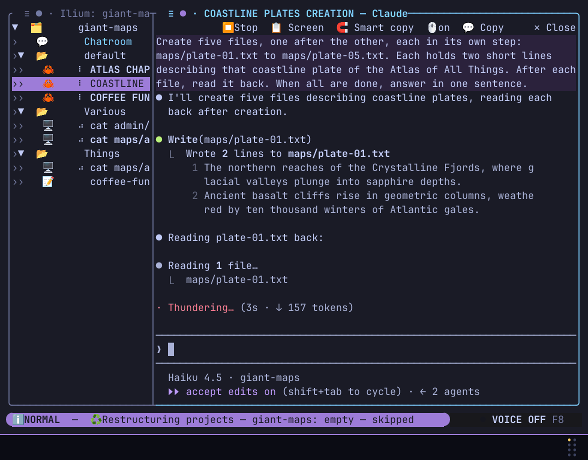</a>

**Automatic titles from agent context**

<a href="assets/demos/20-contextual-titles.gif">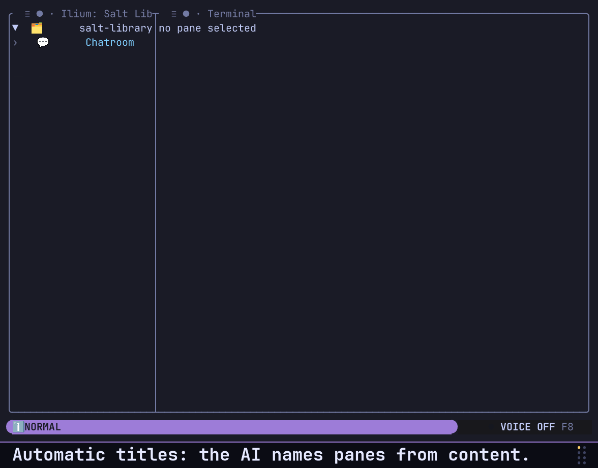</a>

**Delayed input to agents and terminals**

<a href="assets/demos/15-scheduled-input.gif"></a>

**Screen transfer**

<a href="assets/demos/18-screen-transfer.gif"></a>

**Agent costs and stats**

<a href="assets/demos/23-cost-and-stats.gif"></a>

**Settings: interface and board**

<a href="assets/demos/21-settings-tour-a.gif"></a>

**Settings: voice and inference**

<a href="assets/demos/21-settings-tour-b.gif">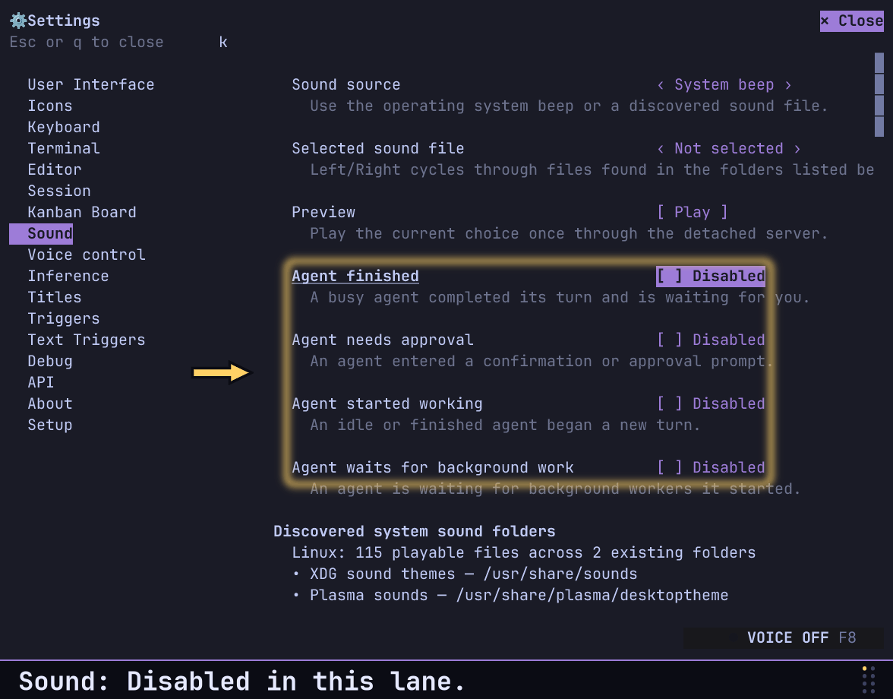</a>

**Settings: titles and setup**

<a href="assets/demos/21-settings-tour-c.gif">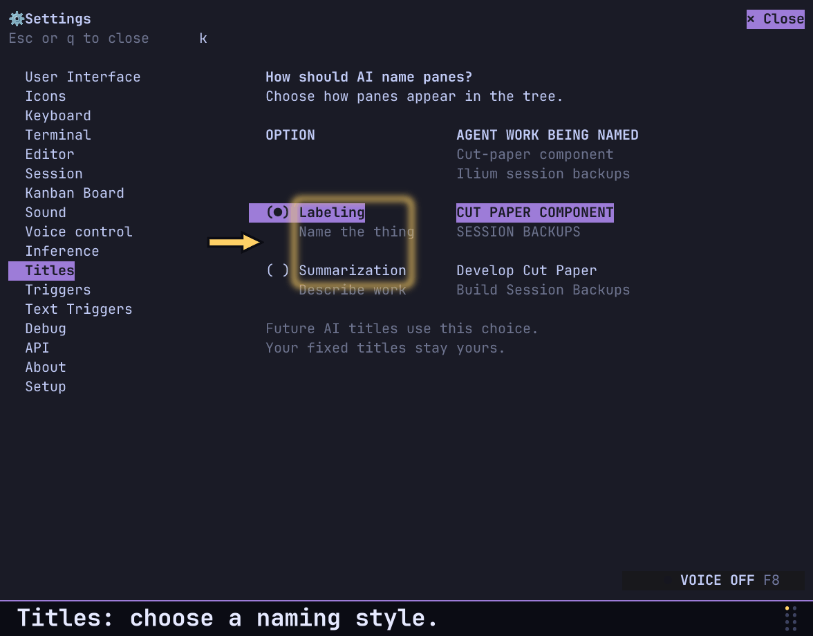</a>

**Rearrangeable pane tree**

<a href="assets/demos/02-pane-tree.gif">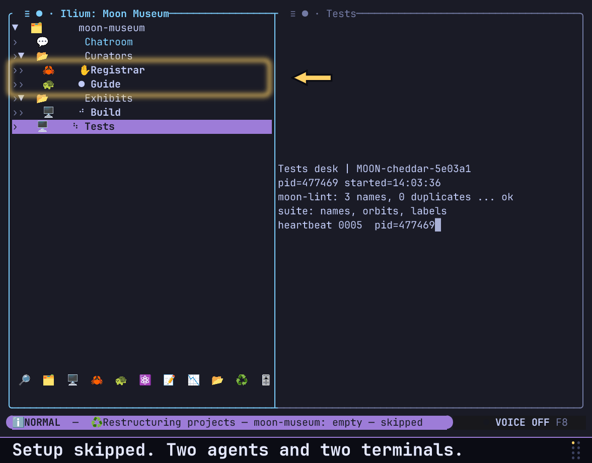</a>

**Persistent mixed splits**

<a href="assets/demos/03-mixed-splits.gif">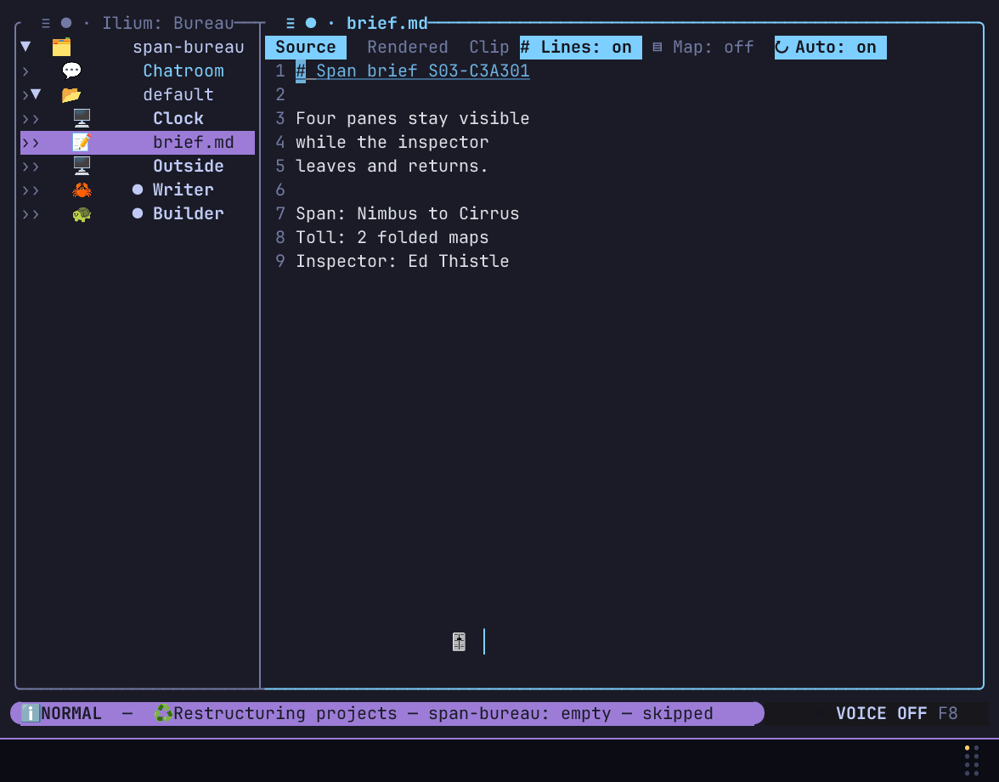</a>

**Smart Copy**

<a href="assets/demos/04-smart-copy.gif">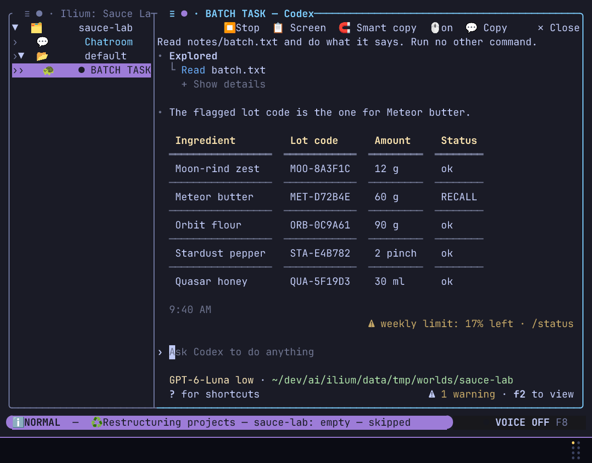</a>

**Ask for update**

<a href="assets/demos/05-ask-for-update.gif"></a>

**Prompt queue**

<a href="assets/demos/06-prompt-queue.gif">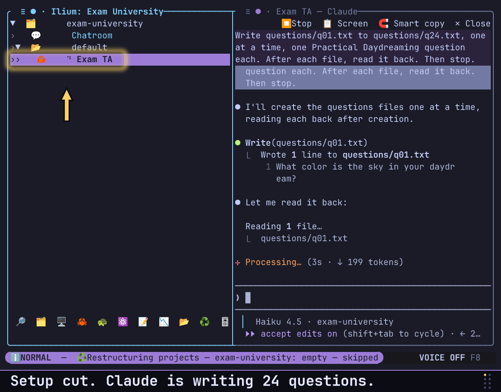</a>

**Progress monitor**

<a href="assets/demos/07-progress-monitor.gif">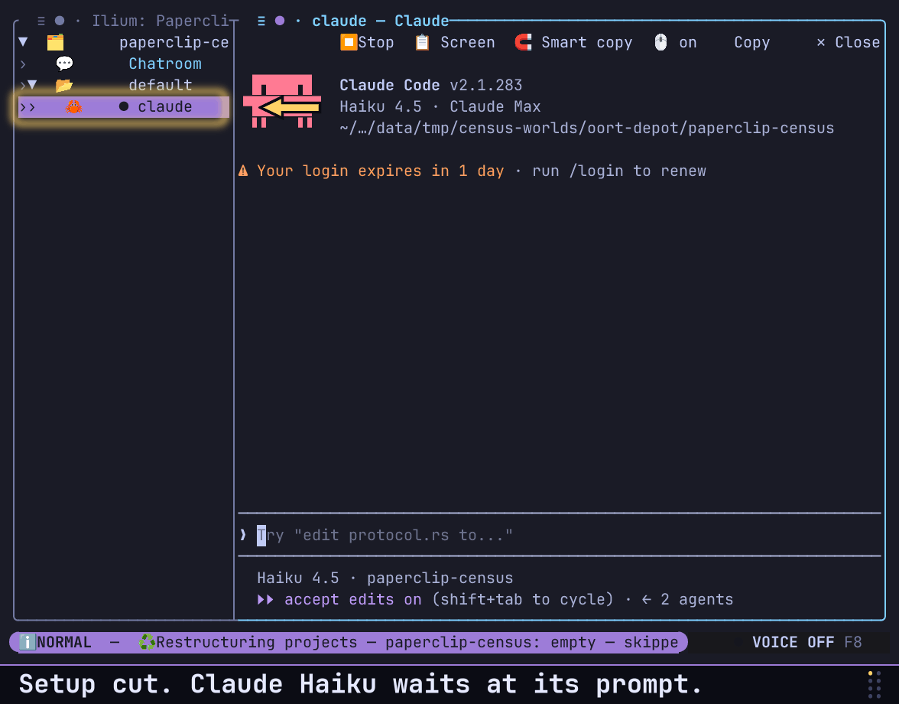</a>

**Kanban board**

<a href="assets/demos/08-kanban.gif"></a>

**Create an agent from a line**

<a href="assets/demos/09-agent-from-line.gif"></a>

**Detach and reattach**

<a href="assets/demos/11-detach-reattach.gif"></a>

**Markdown editor**

<a href="assets/demos/13-markdown-editor.gif"></a>

**Chatroom handoff (temporary preview)**

Codex posts a real handoff. Claude receives it, but its weekly usage limit prevents a reply. This preview will be replaced with the complete exchange after the limit resets.

<a href="assets/demos/14-chatroom-limit-preview.gif"></a>

**Text triggers**

<a href="assets/demos/16-text-triggers.gif">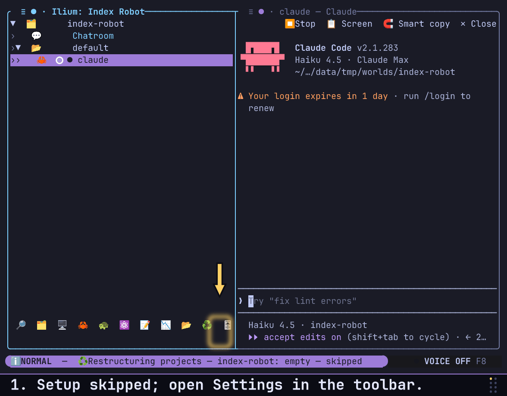</a>

**Goal indicators**

<a href="assets/demos/17-goal-indicators.gif">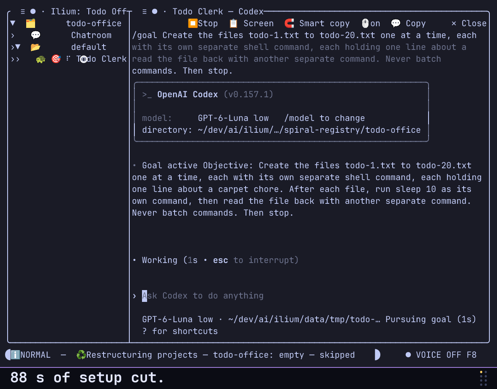</a>

```
╭  ≡ ● · Ilium──────────────────┬  ≡ ● · cargo run─────────────────────────────────────────────────────╮
│▼  🗂️   acme-api               │   Compiling acme-api v0.1.0 (/ram/acme-api)                          │
│›▼  📁   default               │    Finished `dev` profile [unoptimized + debuginfo] target(s)        │
│››   📟   shell                │     Running `target/debug/acme-api`                                  │
│››   📟   cargo test           │acme-api up                                                           │
│››   📟   cargo build --release│█                                                                     │
│››   📟   cargo run            │                                                                      │
│                               │                                                                      │
│                               │                                                                      │
╰───────────────────────────────┴──────────────────────────────────────────────────────────────────────╯
```

## Status

**Early. Expect rough edges.** ilium is usable day to day but has not been through a public release cycle, and the version is `0.1.0` for a reason.

**Linux is the primary, fully-green platform.** macOS and Windows build and run in CI on their own platform-specific code paths (process-tree walks, runtime directories, system sounds); macOS passes but for one known intermittent timing test, and Windows has a small set of known behavioural/timing test failures — reports and fixes welcome.

## What it gives you over tmux

- **A tree, not a grid.** Sessions hold groups, groups hold panes and nested groups, and any node can be dragged, reordered, indented, or outdented. Panes are terminals, built-in editors, or Kanban boards.
- **Agent state at a glance.** ilium detects Claude Code, Codex CLI, and Antigravity by walking the pane's process tree, then reads the screen to classify what that agent is doing right now.
- **Split views.** A container that shows up to four panes side by side, persistently, without losing the tree.
- **Real detach/reattach.** A background server owns the PTYs. Close your terminal, come back, everything is still running.
- **Per-project sessions.** Sessions are scoped to the directory you launch from, so `ilium` in two different projects gives you two independent workspaces.
- **Mouse support that passes through.** Clicks, drags, and scrolls reach `vim`, `htop`, or `lazygit` in whatever xterm encoding they negotiated.
- **Smart Copy.** The agent toolbar's 🧲 **Smart copy** action freezes the visible character grid while the configured inference model streams ranked semantic regions such as URLs, commands, paragraphs, code, tables, cells, and box contents. Hover to preview a region, use the wheel when regions overlap, click to copy, and use **Exit** or `Esc` to return to the live screen.
- **Costs & stats.** On a detected Claude Code or Codex pane, the second header icon (`●`, next to the `≡` that opens the toolbar) opens a stats popover. Hover it to preview, click it to pin it (a close control appears), and click it or the close control to dismiss. Four tabs read the agent's own session transcript: **Overview** (model, run time, active time, turns, tokens, context window, reported cost, rate limits), **Tokens** (input, cache, output and reasoning breakdown, per-model usage, context size over time), **Activity** (events over time, turn durations, tool usage). The popover fills the right-hand panel, and every over-time graph is drawn in the style of asciichart (numeric axis, connected box-drawing lines, several series overlaid), and **Prompts** (the latest prompts you sent). The transcript is read incrementally in a background thread, so multi-gigabyte sessions stay responsive. Dollar cost is shown only where the agent recorded it (Claude Code writes a snapshot when a session closes or resumes); nothing is estimated.

### Pane states in the sidebar

Every pane row has three icon slots before its title, read left to right:

1. **What it is**: the agent's identity icon (🦀 Claude Code, 🐢 Codex, ⚛️
   Antigravity, 🤖 any other agent) or 🖥️ for a plain terminal.
2. **Long-term objective**: the agent's `/goal` state (🎯 active, ⏸️ paused,
   🚧 blocked, ⌛ usage-limited, 🏁 reached), otherwise a monitored task, or
   ⏰ for a scheduled input. A monitored task is a braille bar that fills in
   twelve steps (○ before its first report); ✅ done, ❌ failed, or ⚠ Ilium
   lost sight of it report its outcome (bold until you open or type into the
   pane, dim afterwards).
3. **Right now**: what the agent is doing this turn (⠋ working, ✋ waiting
   for your approval, 🕗 waiting on subagents, 🌀 settling leftover work, 💤
   parked on a monitored task, 🔔 finished and unread, ● idle; ⠋ and 🕗
   animate). When a goal owns the second
   slot, a monitored task shows here instead of the idle mark. For a plain
   shell this slot shows recent output activity.

Hover over any status icon to see what it means. Every icon is configurable in
Settings → Icons.

A finished turn stays marked 🔔 until you actually open that pane, so you
cannot miss one while looking elsewhere. An agent that ends its turn while a
monitored task is still running is parked, not finished: it does not ring or
notify. Ilium sends a desktop notification when the task itself completes,
fails, or loses its monitor.

## Install

Requirements:

- Linux (see [Status](#status))
- Rust **1.89 or newer** (`rustup` recommended)
- A terminal with 256-color and UTF-8 support

```sh
git clone https://github.com/arthurwolf/ilium
cd ilium
make install
```

That builds `ilium` and `ilium-server` in release mode and installs both into `$CARGO_HOME/bin` (`~/.cargo/bin` by default). Make sure that directory is on your `PATH`. To install elsewhere:

```sh
make install BIN_DIR=~/.local/bin
```

> **Why not `cargo install ilium`?** ilium depends on a patched `vt100` (an unreleased upstream fix for a resize panic) wired in through `[patch.crates-io]`. That patch only applies to this workspace, so a crates.io install would silently build against the broken version. Until the fix is released upstream, building from a clone is the supported path. See [ARCHITECTURE.md](ARCHITECTURE.md#a-note-on-the-vendored-vt100).

Both binaries are needed: the `ilium` CLI spawns `ilium-server` as a detached process. It looks for `ilium-server` next to the `ilium` executable first, falling back to your `PATH`, so as long as `make install` puts them in the same directory you only need that directory on your `PATH`.

## Quickstart

```sh
cd ~/code/my-project
ilium
```

That attaches to (or creates) this project's `default` session. Then:

- `Ctrl+B c` — new terminal pane
- `Ctrl+B !` — prompt for a command and run it in a new pane
- `Ctrl+B ↓` / `Ctrl+B ↑` — move between panes
- `Ctrl+B ?` — the full keyboard reference
- `Ctrl+B d` — detach; everything keeps running

Start an agent by opening a terminal and running `claude` or `codex` in it — ilium notices on its own, no configuration needed. The tree's right-click menu also has one-click entries for launching each supported agent.

### Agents in Git worktrees

Use the agent button in the tree footer or a project's right-click menu to
start Claude Code, Codex, or Antigravity on a new branch in its own Git
worktree. The form previews the branch, base, and checkout location before
creation. You can also choose an existing linked worktree. Its pane retains
that directory across detach and restore, and the branch appears on a second
line in the tree. Hover the branch to refresh and inspect Git status.
Git runs the repository's checkout hooks and filters when it creates the
worktree. Repositories using submodules or Git LFS may need an additional
post-create command, configurable in **Settings > Git**.
On Linux, a configured setup command runs after copied worktree files are
ready and before the agent starts. The CLI worktree command uses the same
saved setting. A nonblank setup command is unavailable on other platforms;
Ilium rejects creation there before changing Git.
If creation reports a retained worktree, inspect the reported path before
removing it with Git; setup or checkout hooks may have written files there.

For scripts, start a new branch without opening the TUI:

```sh
ilium new-pane --worktree --branch agent/fix-login --base main -- codex
```

The command emits JSONL progress and a final result with the pane and
worktree path. Omit `--base` to use the repository's default base. Worktrees
that Ilium created can be removed from the pane's **Worktree** menu after
the server checks the registered path, running processes, and local files.
Opening an existing worktree does not transfer ownership to Ilium.
Use **Manage worktrees…** from the project menu to inspect registered
worktrees, see why a checkout cannot be removed, and remove a retained Ilium
checkout. Safe removal keeps the branch by default. Discarding files requires
typing the checkout's full path; branch deletion is a separate choice and
only succeeds when Git accepts a safe delete. Foreign worktrees remain listed
but cannot be removed by Ilium.

**Settings > Git** can offer removal when an agent pane closes. Ilium shows
the offer only after it verifies the worktree is clean, its branch is merged,
and no other pane or unresolved custody ticket claims that directory. Choosing
No keeps the checkout and branch. A blocked or uncertain removal leaves the
checkout for manual inspection. Older Ilium ownership markers without process
custody information also remain protected: Ilium refuses new terminals there
and automatic removal. Inspect those exact Git worktree registrations and
files manually before removing them outside Ilium.

### CLI

| Command | What it does |
|---|---|
| `ilium` | Attach to or create this project's `default` session |
| `ilium new-session <name>` | Create/attach a named session in this project |
| `ilium ls` | List this project's sessions and whether each is running |
| `ilium kill-session <name>` | Gracefully end a session and all its panes |
| `ilium new-pane --session <name> -- <cmd>` | Add a pane running `<cmd>` without attaching a TUI |
| `ilium new-pane --worktree --branch <name> [--base <ref>] -- codex` | Start a supported agent in a new Git worktree |
| `ilium chat …` | File-backed room so agents in a project can coordinate |

Useful flags: `--cwd <dir>` targets another project directory, `--restart-server` replaces the running server while keeping the session snapshot (use after installing a new build), and `--reset-session` deletes this project's snapshot and starts empty.

## Keybindings

Two prefixes, both remappable (both default to `Ctrl+B`):

- **Leader — `Ctrl+B`** for commands (`[keyboard].shortcut_base`)
- **Tree navigation — `Ctrl+B`** for moving through the tree (`[keyboard].navigation_shortcut_base`)

`Ctrl+B` is also tmux's prefix, so inside tmux either press it twice (tmux's default `send-prefix`) or move ilium's leader to another letter, for example `Ctrl+A`, in Settings → Keyboard.

`Ctrl+B ?` always shows the live table, including any remapping you have done.

### Tree navigation (`Ctrl+B`)

| Key | Action |
|---|---|
| `↓` / `↑` | Cycle to the next/previous pane in the current group |
| `PgDn` / `PgUp` | Jump to the first pane in the next/previous group |

### Commands (`Ctrl+B`)

| Key | Action |
|---|---|
| `c` | New terminal pane in the selected group |
| `e` | New editor pane (opens a file picker) |
| `B` | New board (choose storage format and location) |
| `g` | New group |
| `"` | New vertical or horizontal split view |
| `F` | Open a folder in the sidebar |
| `!` | Prompt for a command, run it in a new terminal pane |
| `x` | Close the selected pane or group |
| `,` | Rename the selected node |
| `m` | Move mode (up/down reorders, left/right outdents/indents) |
| `t` / `P` | Focus the tree panel / the active pane |
| `o` / `;` | Focus the next/previous visible pane |
| `h` `j` `k` `l` | Focus the visible pane left/down/up/right |
| `[` / `]` | Scroll the focused terminal one page up/down |
| `f` | Search terminal history and open editor buffers |
| `s` | Save the focused editor pane |
| `v` | Toggle editor Source/Rendered view (markdown only) |
| `n` / `b` / `a` | Toggle line numbers / minimap / autosave in the editor |
| `:` | Open settings |
| `?` | Show or hide the help screen |
| `d` | Detach this client, leave the session running |
| `&` | Kill this project session and disconnect every client |

### Mouse and history

Click either panel to focus it. Tree rows support expand/collapse, double-click rename, hover reorder arrows, drag-and-drop reparenting, and right-click context menus.

Terminal history scrolls with the wheel or `Shift+PgUp`/`Shift+PgDn`. `Shift+End` jumps back to live output. `Ctrl+End` is forwarded to full-screen applications that handle it themselves (such as Claude Code).

## Configuration

Config lives at `~/.config/ilium/config.toml` and most of it is editable live from the Settings screen (`Ctrl+B :`), which writes the file for you.

| Table | Covers |
|---|---|
| `[detection]` | Fast/slow poll intervals, plus `[[detection.custom_signatures]]` to teach ilium about an agent CLI it doesn't ship with |
| `[keyboard]` | `shortcut_base`, `navigation_shortcut_base`, and per-action keybinding overrides |
| `[ui]` | Left-panel sizing policy, `tree_order`, per-provider agent icons, theme colors |
| `[sound]` | Which agent transitions play a sound, and which sound |
| `[notifications]` | Desktop notifications on agent completion |
| `[kanban_board]` | Card preview height and minimum column width |
| `[inference]` | Provider and model for optional LLM-assisted naming |
| `[http_api]` | `port` for the loopback automation listener (default `8872`) |
| `[debug]` | `file_logging_enabled` — off by default |
| `[git]` | Agent worktree defaults: where to start, branch prefix, checkout location, base, branch-line visibility, setup command, and close policy |
| `[reset_planning]` | Default-on Claude and Codex public reset monitoring, plus exact or human countdown text |

> **Note on the loopback HTTP API.** Each server binds `127.0.0.1:<port>` and serves `POST /create_agent`, which spawns an agent with a given prompt. It is bound to loopback and never a public interface, but it is **unauthenticated**, so any process running as your user can drive it. Change `[http_api].port` per project if you run several sessions at once — a server that cannot bind its port logs the failure and carries on without the API.

Session snapshots are stored per project in `<project>/.ilium/sessions/<name>.json`. Add `.ilium/` to your project's `.gitignore`.

Settings → Reset planning controls two independent, default-on public reset monitors. While the client is open, Ilium checks the Claude and Codex announcement feeds about once per hour. When a feed reports a scheduled reset, the right end of the status bar shows its time; choose **Exact** for a live days/hours/minutes/seconds countdown or **Human** for rounded wording. An announcement without an exact time is shown as scheduled with time TBD. Claude's public feed currently reports reset history but no future schedule, so it cannot provide a public-reset countdown until that source publishes one. These announcements are separate from the rolling reset times of your own account.

### Agent setup

Ilium can teach coding agents about two facilities they cannot discover from
the terminal UI alone: project Chatroom coordination and long-running-task
progress monitors. It installs and refreshes its own versioned instruction
blocks automatically—there is no per-agent setup step. Claude targets are
`~/.claude/CLAUDE.md` and `<project>/CLAUDE.md`; Codex targets are
`~/.codex/AGENTS.md` and `<project>/AGENTS.md`. Both CLIs get the same text, so a
file that serves both (for example `~/.codex/AGENTS.md` symlinked to
`~/.claude/CLAUDE.md`) holds one block.

Settings → Setup shows the detected state. A custom Claude global file may be
selected for either feature. Ilium only changes blocks identified by its own
markers: hand-written instructions are preserved, and stale managed blocks are
atomically upgraded without rewriting the rest of the file.

The Progress contract is mandatory for an informed agent whenever a task is
expected to last at least three minutes. The agent starts and verifies the job,
validates a cheap JSON probe with `ilium progress check`, then registers it with
`ilium progress set` and waits for the positive JSONL acknowledgement. From
that point the agent must not poll: the detached Ilium server is the sole
recurring poller. It keeps task failure separate from probe failure, displays a
sticky terminal result, and submits that result to the agent as a message once
its composer is ready, so the agent learns when the task succeeds or fails
without polling. Ilium only displays an agent's `/goal` state and never pauses, resumes,
or otherwise controls it; progress monitoring does not mention `/goal` either.

### Optional LLM features

ilium can use an LLM to auto-name sessions and panes, reorganize the tree, and identify semantic regions for Smart Copy. This is **optional and off the critical path** — every core feature (multiplexing, detection, splits, persistence) works without any credentials. Providers supported: Kilo Gateway (default, has a free tier), local Ollama, OpenAI-compatible endpoints, Anthropic, and OpenRouter. Configure under Settings → Inference, or turn automatic naming/organization behavior off under Settings → Triggers.

Automatic retitling and tree restructuring are **on by default** (Settings → Triggers): panes are retitled as agents start, work, and finish, a finished agent's project is restructured, and every project is restructured once when a session loads. The default provider, Kilo Gateway with the free `stepfun/step-3.7-flash:free` model, needs no account or key, only network access (anonymous free calls are rate-limited per public IP; the `kilo-auto/free` router is not the default because its 1,000,000-token context window rejects the 1,000,000-token output allowance Ilium requests). To use your own provider instead, choose it in Settings → Inference: for a local Ollama, start `ollama serve`, pull a model (for example `ollama pull qwen3:0.6b`), select **Ollama (local)** and pick that model; for OpenAI-compatible, Anthropic, or OpenRouter, paste the API key. With no reachable provider nothing breaks: automatic titles keep their fallback names, the status bar reports the failure, and automatic restructuring backs off from one to thirty minutes between retries.

Settings → Titles chooses how future AI-authored pane titles are written. **Labeling** makes a compact uppercase name for the thing you would look for again in the tree; **Summarization** describes the session's work. The choice also applies to requested AI retitles and tree restructuring. Changing it does not rename existing panes, and titles you renamed yourself remain fixed.

Kilo paid-proxy egress is a hand-edited option. Set `paid_proxies_enabled = true` under `[inference.kilo_gateway]`, then configure the MongoDB `uri`, `database`, `collection`, and proxy field names under `[inference.kilo_gateway.proxy_database]` and its `.structure` table. Ilium reads enabled rows at client boot; proxy records are not stored in `config.toml`.

Voice control is a separate opt-in feature requiring an OpenAI Realtime key; it is disabled unless you configure it.

Debug file logging is off by default because it records full HTTP and LLM request/response bodies. Credential headers and URL parameters are redacted when it is on.

### Voice control

Voice control (`F8`, or Settings → Voice control) lets you talk to Ilium: a realtime model hears you, decides what you mean, and either operates Ilium or types what you said into the focused agent. It needs an OpenAI Realtime key and is off until you turn it on.

You can also **type to the same voice session**, as if you had said it. `ilium voice say` hands each sentence to the running voice session as one turn of the conversation, and the model interprets it exactly as it would speech: it can operate the tree, open settings, or dictate the sentence into the active agent. Text and microphone audio are interchangeable and can be mixed freely; nothing else about the session changes.

```sh
ilium voice say "open the settings"
ilium voice say "create a Codex agent" "then tell it to fix the failing test"
printf '%s\n' "focus the first agent" "say hello to it" | ilium voice say -
ilium voice say --start "what agents are running?"
```

Each sentence is its own turn, in order; a lone `-` reads one sentence per non-empty line from standard input (put `--` first for a sentence that begins with a hyphen). A request carries at most 32 sentences of 4,000 characters each.

The voice session lives in an interactive Ilium client, so one must be attached to the session (`ilium` in the project). Run from inside an Ilium pane the command talks to that pane's session; anywhere else it uses `--cwd` and `--session-name` (default `default`). It never starts a server. If several clients are attached, exactly one receives the text: a client whose voice is already running is preferred over one that is off.

When voice control is off the command fails with code `voice-off` and changes nothing. With `--start` it switches voice control on instead (and saves that setting, exactly as `F8` does), or restarts a session that failed to start. `--timeout-s` (default 30) bounds the wait for the session to accept the text; starting voice takes longer than reaching one that is already running.

The output is JSONL on stdout, one object per line, each with a `type`; the exit status is non-zero after an `error`:

```json
{"type":"progress","command":"voice say","stage":"sending","request_id":1,"session":"default","socket":"/run/user/1000/ilium/...","session_source":"cwd","sentence_count":2,"start":false}
{"type":"result","command":"voice say","ok":true,"request_id":1,"session":"default","sentence_count":2,"accepted_sentences":2,"voice_phase":"listening","started_voice":false,"delivery":"queued-to-voice-session"}
{"type":"error","command":"voice say","ok":false,"request_id":1,"code":"voice-off","message":"voice control is off; press F8 in the Ilium client or pass --start","hint":"pass --start to switch voice control on, or press F8 in the Ilium client"}
```

`result` means the sentences are in the live voice session's queue (`voice_phase` says what it was doing, `connecting` right after a start); it does not mean the model has acted on them yet, because the provider sends no per-turn acknowledgement. While the model is still answering, later sentences wait for it to finish rather than interrupting it. Error `code` values:

| `code` | Meaning |
|---|---|
| `invalid-request` | No sentences, an empty or oversized sentence, or too many of them |
| `session-not-running` | No server is running for that project session |
| `connection-failed` | The session's server could not be reached |
| `no-voice-client` | No interactive Ilium client is attached to host the voice session |
| `voice-off` | Voice control is off and `--start` was not given |
| `voice-unavailable` | Voice control is on but its session could not run (the message says why, for example a missing API key or audio device) |
| `client-unresponsive` | The attached client did not answer in time |
| `timeout`, `server-closed-connection` | No answer arrived; a server started before this command existed cannot answer it, so restart Ilium after upgrading |

To exercise the whole path without a key or a microphone (tests, demos), point the voice session at a scripted loopback server with `ILIUM_VOICE_REALTIME_URL=ws://127.0.0.1:<port>/v1/realtime` and add `ILIUM_VOICE_AUDIO=none` to skip opening audio devices. Only loopback `ws://` URLs are accepted, so microphone audio can never be redirected to a remote host.

## How it works

A short version: one `ilium-server` process per project session owns every PTY and the tree; the TUI is a thin client talking to it over a Unix socket with length-prefixed bincode frames. Agent identity comes from walking the pane's child process tree (robust), and agent activity comes from scanning the rendered screen (the only way to know if a turn is in progress). Panes that are working get polled fast; idle ones get polled slowly.

The long version — crate boundaries, the detection design, the wire protocol, and the milestone history — is in **[ARCHITECTURE.md](ARCHITECTURE.md)**.

## Alternatives

If ilium isn't the right fit, [Zellij](https://github.com/zellij-org/zellij) is the mature Rust multiplexer, [claude-squad](https://github.com/smtg-ai/claude-squad) drives tmux plus git worktrees for parallel agents, and **herdr** already ships agent-state detection in a flat sidebar. ARCHITECTURE.md has a fuller [comparison](ARCHITECTURE.md#prior-art--why-not-just-use-x).

## Contributing

Issues and pull requests are welcome. Before submitting:

```sh
cargo fmt --check
cargo clippy --workspace --all-targets
cargo test --workspace
```

[CLAUDE.md](CLAUDE.md) documents the layering rules and conventions this codebase is held to; it is worth skimming before a non-trivial change.

## License

MIT — see [LICENSE](LICENSE).

Two dependencies are vendored in-tree and keep their own licenses: `vendor/vt100` (MIT, © Jesse Luehrs) carries an unreleased upstream fix, and `ilium-client/vendor/tui-tree-widget` (MIT, © EdJoPaTo) is a local fork. The bundled Cascadia Code font is licensed under the SIL Open Font License 1.1 (© Microsoft Corporation); see `ilium-client/assets/fonts/NOTICE.md`.
