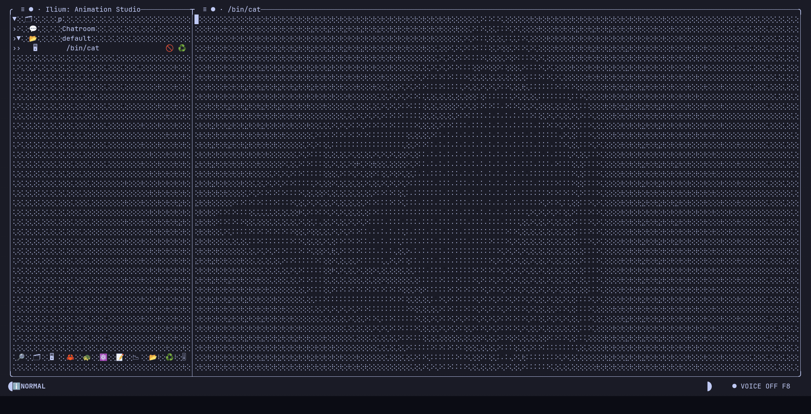
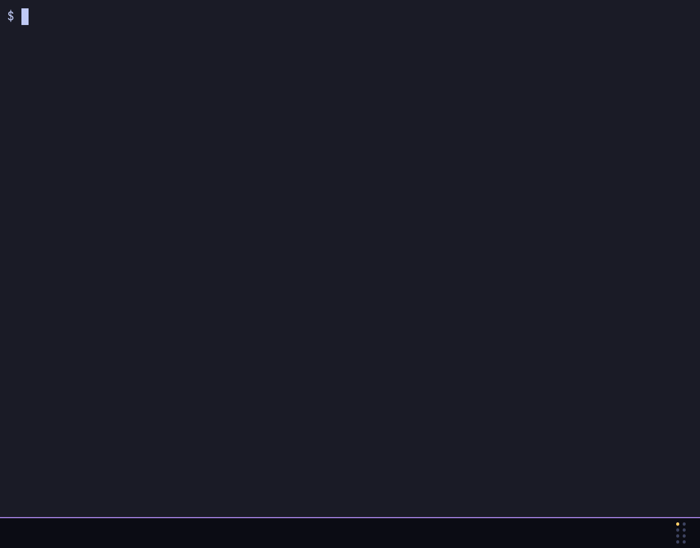
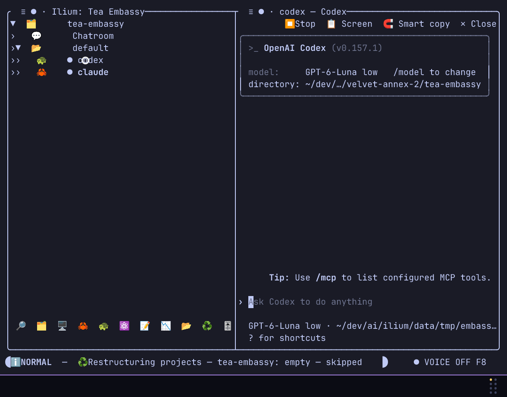

# Demo gallery

Recorded demonstrations of Ilium, one per feature. Each demo is an animated GIF stored in [`assets/demos/`](../../assets/demos/) and is followed by a link to the page that explains the feature step by step. The short selection shown on the project [README](../../README.md) is drawn from this gallery.

## Contents

- [AI names agents and organizes the project tree](#ai-names-agents-and-organizes-the-project-tree)
- [Control Ilium and prompt agents with voice](#control-ilium-and-prompt-agents-with-voice)
- [Give agent panes automatic titles](#give-agent-panes-automatic-titles)
- [Transfer a terminal screen between panes](#transfer-a-terminal-screen-between-panes)
- [Inspect agent usage and recorded costs](#inspect-agent-usage-and-recorded-costs)
- [Track agent status and current goals](#track-agent-status-and-current-goals)
- [Use agents, editors, and terminals side by side](#use-agents-editors-and-terminals-side-by-side)
- [Select and copy terminal output](#select-and-copy-terminal-output)
- [Queue prompts for an agent](#queue-prompts-for-an-agent)
- [Get results from background tasks](#get-results-from-background-tasks)
- [Search agents, files, and terminals](#search-agents-files-and-terminals)
- [See live agent goals in the project tree](#see-live-agent-goals-in-the-project-tree)
- [Resume agent sessions after a reboot](#resume-agent-sessions-after-a-reboot)
- [Choose an animation, then watch it play](#choose-an-animation-then-watch-it-play)
- [Schedule input for a pane](#schedule-input-for-a-pane)
- [Set interface and board preferences](#set-interface-and-board-preferences)
- [Configure voice and AI providers](#configure-voice-and-ai-providers)
- [Configure automatic titles](#configure-automatic-titles)
- [Rearrange panes without stopping their processes](#rearrange-panes-without-stopping-their-processes)
- [Request updates from active agents](#request-updates-from-active-agents)
- [Track work on a Kanban board](#track-work-on-a-kanban-board)
- [Start a Codex agent from a TODO](#start-a-codex-agent-from-a-todo)
- [Detach and reconnect while agents keep running](#detach-and-reconnect-while-agents-keep-running)
- [Edit Markdown in a pane](#edit-markdown-in-a-pane)
- [Coordinate Claude and Codex with Chatroom](#coordinate-claude-and-codex-with-chatroom)
- [Respond to confirmation prompts automatically](#respond-to-confirmation-prompts-automatically)
- [Restore panes and resume agent sessions](#restore-panes-and-resume-agent-sessions)
- [Run agents in their own worktrees](#run-agents-in-their-own-worktrees)
- [Convert a session between Claude and Codex](#convert-a-session-between-claude-and-codex)
- [Additional file](#additional-file)
- [Duplicate file names](#duplicate-file-names)

## AI names agents and organizes the project tree

Ilium reads what each agent is working on, gives its pane a name and can regroup the tree around that work. Explained in [Titles and instructions](titles-and-instructions.md).

## Control Ilium and prompt agents with voice

Spoken commands run Ilium actions, and dictated text is sent to an agent as a prompt. Explained in [Voice](voice.md).

## Give agent panes automatic titles

Automatic titles follow the pane's content, and a name you typed yourself is never overwritten. Explained in [Titles and instructions](titles-and-instructions.md).

## Transfer a terminal screen between panes

The visible screen of one terminal is sent to another pane, for example to hand context to an agent. Explained in [Panes and layout](panes-and-layout.md).

## Inspect agent usage and recorded costs

The statistics view shows an agent's tokens, activity, prompts and the cost Ilium recorded for it. Explained in [Agent cost](agent-cost.md).

## Track agent status and current goals

The tree shows each agent's live status and, where the CLI reports one, its current goal. Explained in [Agent monitoring](agent-monitoring.md).

## Use agents, editors, and terminals side by side

Terminal, editor and board panes share one split view, with the project tree still visible. Explained in [Panes and layout](panes-and-layout.md).

## Select and copy terminal output

Select a region of terminal output and copy it, with Smart Copy recognising paths, URLs and similar tokens. Explained in [Smart Copy](smart-copy.md).

## Queue prompts for an agent

Prompts queued for an agent are delivered one by one as each of its turns finishes. Explained in [Automation](automation.md).

## Get results from background tasks

A progress monitor watches a background task and tells the agent when it finishes or fails. Explained in [Automation](automation.md).

## Search agents, files, and terminals

Workspace search finds agents, files and terminal contents and jumps to the chosen match. Explained in [Panes and layout](panes-and-layout.md).

## See live agent goals in the project tree

A live Codex goal changes the objective icon beside the agent in the project tree. Explained in [Agent monitoring](agent-monitoring.md).

## Resume agent sessions after a reboot

After a restart, Ilium restores the pane layout and resumes the Claude and Codex sessions. Explained in [Session recovery](session-recovery.md).

## Choose an animation, then watch it play

A tour of the ambient background animations, picked from Settings and shown full screen. Explained in [Animations](animations.md).

## Schedule input for a pane

A timer sends text to an agent pane and then to a terminal pane after a set delay. Explained in [Automation](automation.md).

## Set interface and board preferences

The first chapter of the settings tour: interface and board options. Explained in [Settings](settings.md).

## Configure voice and AI providers

The second chapter of the settings tour: voice and AI provider configuration. Explained in [Inference and privacy](inference-and-privacy.md).

## Configure automatic titles

The third chapter of the settings tour: automatic titles and setup options. Explained in [Titles and instructions](titles-and-instructions.md).

## Rearrange panes without stopping their processes

A pane is moved into a group and reordered while the program inside it keeps running. Explained in [Panes and layout](panes-and-layout.md).

## Request updates from active agents

One action sends a status request to every active agent. Explained in [Agent monitoring](agent-monitoring.md).

## Track work on a Kanban board

A card is moved across the columns of a Kanban board pane. Explained in [Editors and boards](editors-and-boards.md).

## Start a Codex agent from a TODO

An agent is started from a TODO line in a source window and works on that line. Explained in [Editors and boards](editors-and-boards.md).

## Detach and reconnect while agents keep running

The client detaches and later reattaches while panes and agents keep running in the server. Explained in [Panes and layout](panes-and-layout.md).

## Edit Markdown in a pane

A Markdown note is edited in a pane next to the agents. Explained in [Editors and boards](editors-and-boards.md).

## Coordinate Claude and Codex with Chatroom

Two agents exchange a handoff through the project's Chatroom. Explained in [Automation](automation.md).

## Respond to confirmation prompts automatically

A text trigger recognises an agent's confirmation question and answers it automatically. Explained in [Automation](automation.md).

## Restore panes and resume agent sessions

Panes are restored from a snapshot and the agents continue from their resumed context. Explained in [Session recovery](session-recovery.md).

## Run agents in their own worktrees

An agent runs in its own linked worktree on its own branch, with the path, branch and diff visible in a terminal. Explained in [Worktrees](worktrees.md).

## Convert a session between Claude and Codex

A session is converted from Claude to Codex and back while keeping its context. Explained in [Session recovery](session-recovery.md).

## Additional file

`14-chatroom-limit-preview.gif` in the same directory is a companion recording to the Chatroom demo above, named for the Chatroom message limit. Chatroom is covered in [Automation](automation.md).

## Duplicate file names

The `assets/demos/` directory also holds copies of several demos under earlier numbering. They are byte-identical to the files shown above (checked by checksum), so they are not repeated in this gallery. Use the names above in links.

| Older name | Same recording as |
| --- | --- |
| `01-agent-activity.gif` | `08-agent-activity.gif` |
| `02-pane-tree.gif` | `09-pane-tree.gif` |
| `03-mixed-splits.gif` | `10-mixed-splits.gif` |
| `04-smart-copy.gif` | `11-smart-copy.gif` |
| `05-ask-for-update.gif` | `12-ask-for-update.gif` |
| `06-prompt-queue.gif` | `13-prompt-queue.gif` |
| `07-progress-monitor.gif` | `14-progress-monitor.gif` |
| `08-kanban.gif` | `15-kanban.gif` |
| `09-agent-from-line.gif` | `16-agent-from-line.gif` |
| `10-workspace-search.gif` | `17-workspace-search.gif` |
| `11-detach-reattach.gif` | `18-detach-reattach.gif` |
| `12-ai-tree.gif` | `01-ai-tree.gif` |
| `13-markdown-editor.gif` | `19-markdown-editor.gif` |
| `14-chatroom.gif` | `20-chatroom.gif` |
| `15-scheduled-input.gif` | `04-scheduled-input.gif` |
| `16-text-triggers.gif` | `21-text-triggers.gif` |
| `17-goal-indicators.gif` | `22-goal-indicators.gif` |
| `18-screen-transfer.gif` | `05-screen-transfer.gif` |
| `19-snapshot-resume.gif` | `23-snapshot-resume.gif` |
| `20-contextual-titles.gif` | `03-contextual-titles.gif` |
| `21-settings-tour-a / b / c.gif` | `07a / 07b / 07c-settings-tour.gif` |
| `22-voice-control.gif` | `02-voice-control.gif` |
| `23-cost-and-stats.gif` | `06-cost-and-stats.gif` |
